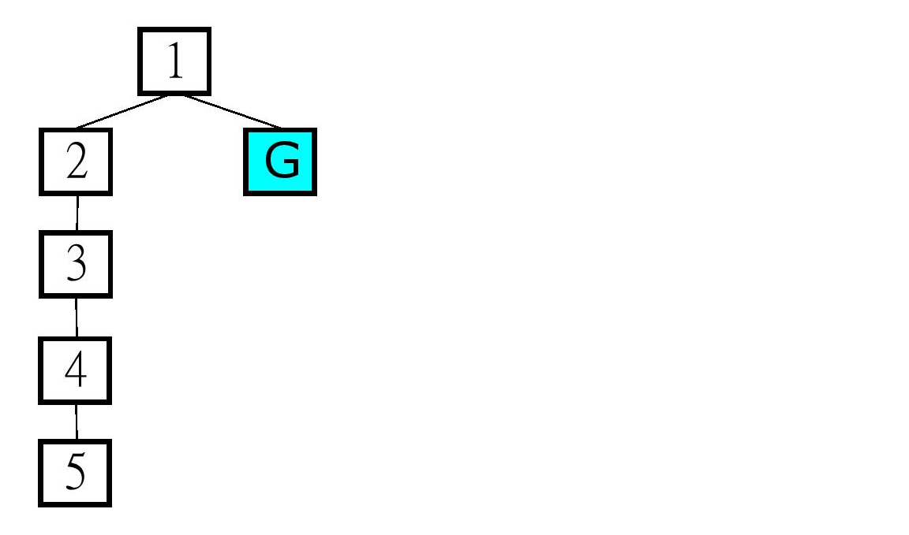

# Missionaries and Cannibals 
Ping-Jung Liu September 9th 2017
### 1. Introduction
The classic missionaries and cannibals problem consists of three missionaries at the starting bank, three cannibals at the starting bank, and a boat of size two. The objective is to move all six of them to the ending bank. The problem has two main constraints: (1) The boat requires at least one person to sail. (2) At any given time, the number of cannibals cannot exceeds the number of missionaries on either side of the river, or the missionaries would get eaten.  
  
The states of this problem can be represented by three elements tuple (M, C, B), in which M indicates the number of missionaries on the starting bank; C indicates the number of cannibals on the ending bank; B indicates where the boat is with 1 on start and 0 on end. The numbers can be obtained by simple subtracting the total numbers of missionaries and cannibals by the numbers on the starting bank. For example, (2, 3, 1) implies there is one missionary on the ending bank. The total number of possible states is then 4 * 4 * 2, which is the result of multiplying the possible numbers of all three elements. The number of states can be generalized into the formula (TotalM + 1) * (TotalC + 1) * (BoatNumber + 1).  
  
The following figure shows the first three layers of the state machine starting from (3, 3, 1), the start state.

Every state has five probable children, move one missionary, move two missionaries, move one cannibal, move two cannibals, move one missionary and one cannibal. The blue and yellow states indicate safe and legal states, but the yellow ones are visited states. Red ones are simply out of the constraints or unsafe.

### 2. Problem Model
The get_successors method is the central part of the model, implemented in CannibalProblem.py, which returns the list of safe and legal states of a given state. The method loops through all possible children of the given state, both legal and illegal, and filter out those that are not safe and legal with a legalsafe method.  
  
get_successors as follow:

	def get_successors(self, state):
        # current numbers of missionaries and cannibals on the start side
        Mnum = state[0]
        Cnum = state[1]
        boat = self.boat
        # will be the list of legal successors
        stateList = []
        # loop through the possible actions
        for m in range(0, boat + 1):
            for c in range(0, boat - m + 1):
                
                # if boat at start side, move it to the end then subtract Mnum and Cnum
                if state[2] == 1 :
                    if m + c != 0:
                        Mnum = state[0] - m
                        Cnum = state[1] - c
                        if legalsafe((Mnum, Cnum, 0), self.totalM, self.totalC):
                            stateList.append((Mnum, Cnum, 0))

                    # else move it back to the start then add Mnum and Cnum
                else :
                    if m + c != 0:
                        Mnum = state[0] + m
                        Cnum = state[1] + c
                        if legalsafe((Mnum, Cnum, 1), self.totalM, self.totalC):
                            stateList.append((Mnum, Cnum, 1))
        return stateList

The legalsafe method takes in a state and uses several simple ifelse statements to return whether the state is safe and legal or not.

	def legalsafe(state, totalM, totalC):
	    if state[0] < 0 or state[1] < 0:
	        result = False
	
	    elif state[0] > totalM or state[1] > totalC:
	        result = False
	
	    # check whether missionaries at start side are safe
	    elif state[0] > 0 and state[0] < state[1]:
	        result = False
	
	    # check whether missionaries at end side are safe
	    elif state[0] < totalM and (totalM - state[0]) < (totalC - state[1]):
	        result = False
	
	    else:
	        result = True
	
	    return result

I also wrote a goal_test method in the problem class to the search algorithms to determine the goal state.

	def goal_test(self, state):
        return state[0] == 0 and state[1] == 0 and state[2] == 0

I tested the class by finding the successors of the start state (3, 3, 1). 

	if __name__ == "__main__":
	    test_cp = CannibalProblem((3, 3, 1))
	    print(test_cp.get_successors((3, 3, 1)))
	    print(test_cp)

The result indeed corresponded with the state machine I provided.

	[(3, 2, 0), (3, 1, 0), (2, 2, 0)]
	Missionaries and cannibals problem: (3, 3, 1)

### 3. Breadth First Search
All of the algorithms are implemented in uniformed_search.py.
The first algorithm I implemented is the classic breadth first search, which scans through a graph layer by layer. In the code I used a list to store the states to be visited and a dictionary to record states that have been visited. The reason to choose dictionary instead of list was that python dictionary is in fact a hash table and it has constant time look up, while list has linear time look up.  
  
Breadth First Search code as follow:

	def bfs_search(search_problem):
	    # create solution
	    solution = SearchSolution(search_problem, "BFS")
	    s_p = search_problem
	
	    # create frontier que
	    que = deque()
	    # the visited dict is a mapping between child and parent
	    visited = {}
	
	    # put start_state into que and visited
	    que.append(s_p.start_state)
	    visited[s_p.start_state] = None
	
	    visited_nodes = 0
	    while(not len(que) == 0):
	
	        # get the first element in que
	        toVisit = que.popleft()
	
	        # if toVisit state is the goal, backchain and return solution
	        if(s_p.goal_test(toVisit)):
	            solution.path = backchain(toVisit, visited)
	            solution.nodes_visited = visited_nodes
	            return solution
	
	        # if not the goal, obtain its successors
	        successors = s_p.get_successors(toVisit)
	
	        # loop through the successors, if not visited, put to the back of que and save into visited
	        for child in successors:
	            if(not child in visited):
	                que.append(child)
	                visited[child] = toVisit
	                visited_nodes = visited_nodes + 1
	
	    # if the search never reach goal state, return [] as path            
	    solution.path = []
	    solution.nodes_visited = visited_nodes
	
	    return solution
As you can see, when the next toVisit state is the goal, the method will call backchain and return the solution path. The backchain method takes in the goal state and uses the visited set from bfs_search to obtain the path that leads from the start state to the goal state.  
  
backchain code as follow:

	def backchain(state, visited):
	
	    # use the child and parent pairs in visited to track solution path
	    result = [state] 
	    prev = visited[state]
	
	    # if prev = none, then it must be the start state --> break the loop
	    while(not prev == None):
	        result.append(prev)
	        prev = visited[prev]
	
	    # reverse the result for correct representation
	    result.reverse()
	    return result
I tested bfs_search with numerous cases including (3, 3, 1) the original problem, (5, 5, 1) which has no solution, (5, 4, 1) which the DFS (next section) cannot find optimal path, and (1, 1, 1) which has solution of length one. The first thre elements in the solution of (3, 3, 1) corresponds with the graph I drew in section 1.
  
Testing results for bfs as follow:
	
	Missionaries and cannibals problem: (3, 3, 1)
	attempted with search method BFS
	number of nodes visited: 14
	solution length: 12
	path: [(3, 3, 1), (3, 1, 0), (3, 2, 1), (3, 0, 0), (3, 1, 1), (1, 1, 0), (2, 2, 1), (0, 2, 0),  
          (0, 3, 1), (0, 1, 0), (0, 2, 1), (0, 0, 0)]

	Missionaries and cannibals problem: (5, 5, 1)
	attempted with search method BFS
	no solution found after visiting 12 nodes

	Missionaries and cannibals problem: (5, 4, 1)
	attempted with search method BFS
	number of nodes visited: 29
	solution length: 16
	path: [(5, 4, 1), (5, 2, 0), (5, 3, 1), (5, 1, 0), (5, 2, 1), (3, 2, 0), (3, 3, 1), (2, 2, 0),  
          (3, 2, 1), (2, 1, 0), (2, 2, 1), (1, 1, 0), (2, 1, 1), (1, 0, 0), (1, 1, 1), (0, 0, 0)]

	Missionaries and cannibals problem: (1, 1, 1)
	attempted with search method BFS
	number of nodes visited: 3
	solution length: 2
	path: [(1, 1, 1), (0, 0, 0)]

### 4. Memoizing Depth First Search
Memoizing depth first search(dfs) is a style of dfs that uses a visited set like bfs to record visited states. But the fact is, memoizing depth first search not necessarily saves memory comparing to bfs, because it may still need to record the whole graph in order to find the state. If the goal is somewhere in the first path, then memoizing depth first search will reach the state faster, thereby saving memory; on the other hand, if the goal is at the end of the second layer, bfs is likely to reach it first; in this case bfs saves more memory. Further example will be provided in the next section.

### 5. Path-checking Depth First Search
Unlike memoizing depth first search, the path-checking version only keeps track of current path, which can save a decent amount of memory. I separated the recursive function with the main dfs function for clarity. For runtime consideration, I used a set to record the current path. Do note that the return type of dfspc is a list, which is the solution path. The number of nodes will be modified in dfspc.
  
dfs_search code as follow:

	def dfs_search(search_problem, depth_limit=100, node=None, solution=None):
    # if no node object given, create a new search from starting state
    # create empty path and empty path_set for the sake of runtime
	    path = []
	    path_set = {}
	    if node == None and solution == None:
	        node = SearchNode(search_problem.start_state)
	        solution = SearchSolution(search_problem, "DFS")
	
	    # start recursive dfs to find solution
	    path.append(node.state)
	    path_set[node.state] = True
	    path = dfspc(search_problem, node, path_set, path, depth_limit, solution)
	    solution.path = path
	
	    return solution 
recursive function code as follow(note it returns a path):

	def dfspc(search_problem, node, path_set, path, depth_limit, solution):
	
	    solution.nodes_visited = solution.nodes_visited + 1
	    s_p = search_problem
	
	    ##### BASE CASE! if current node is goal, return current path
	    if node.depth > depth_limit:
	        return []
	    elif s_p.goal_test(node.state):
	        return path
	
	    ##### RECURSIVE CASE!
	    # get the successors of current node
	    successors = s_p.get_successors(node.state)
	  
	    # loop through successors and find all those not already in current path
	    for child in successors:
	        if not child in path_set:
	
	            # extend current path, and call dfspc on child for recursion
	            path.append(child)
	            path_set[child] = True
	            node.depth = node.depth + 1
	            node.state = child
	            new_path = dfspc(s_p, node, path_set, path, depth_limit, solution)
	
	            # if the new_path extended from child is [], it is not part of the solution
	            # so remove the child from path
	            if new_path == []:
	                node.depth = node.depth - 1
	                path.remove(child)
	                del path_set[child]
	            else:
	                return path
	
	    return []
Path-checking DFS indeed saves a great amount of memory comparing to BFS, because it only need to memorize the states along the path, while the worst case for BFS may be storing the whole graph. But there are circumstances when path-checking DFS spend more time and require more memory than BFS, as described in the previous section, when the goal state is at the back of the first few layers. Example:
 
I tested path-checking DFS with the test cases as testing BFS, namely (3, 3, 1) (5, 5, 1) (5, 4, 1) (1, 1, 1). Results as follow:

	Missionaries and cannibals problem: (3, 3, 1)
	attempted with search method DFS
	number of nodes visited: 13
	solution length: 12
	path: [(3, 3, 1), (3, 1, 0), (3, 2, 1), (3, 0, 0), (3, 1, 1), (1, 1, 0), (2, 2, 1), (0, 2, 0),  
          (0, 3, 1), (0, 1, 0), (0, 2, 1), (0, 0, 0)]
	
	Missionaries and cannibals problem: (5, 5, 1)
	attempted with search method DFS
	no solution found after visiting 24 nodes
	
	Missionaries and cannibals problem: (5, 4, 1)
	attempted with search method DFS
	number of nodes visited: 21
	solution length: 18
	path: [(5, 4, 1), (5, 2, 0), (5, 3, 1), (5, 1, 0), (5, 2, 1), (3, 2, 0), (3, 3, 1), (2, 2, 0),  
          (3, 2, 1), (2, 1, 0), (2, 2, 1), (1, 1, 0), (2, 1, 1), (1, 0, 0), (1, 1, 1), (0, 1, 0), (0, 2, 1), (0, 0, 0)]
	
	Missionaries and cannibals problem: (1, 1, 1)
	attempted with search method DFS
	number of nodes visited: 4
	solution length: 2
	path: [(1, 1, 1), (0, 0, 0)]
Note that the solution of (5, 4, 1) is two elements longer than the solution found by BFS, because DFS will not necessarily find the best path.

### 6. Iterative Deepening Search(IDS)
The last algorithm implemented was the iterative deepening search, which is another style of dfs. The main idea is to increase the depth limit of dfs one by one, so that the algorithm can save memory while finding the shortest path; the trade off is runtime because the program will then have to run several dfs before finding the solution.  
  
IDS code as follow:

	def ids_search(search_problem, depth_limit=50):

	    # depth limit initially 0
	    depth = 0
	    nodes_visited = 0
	    solution = SearchSolution(search_problem, "IDS")
	
	    # increase depth limit until dfs find a solution
	    while solution.path == [] and depth < depth_limit:
	        nodes_visited = nodes_visited + solution.nodes_visited
	        solution = dfs_search(search_problem, depth)
	        depth = depth + 1
	
	    solution.search_method = "IDS"
	    solution.nodes_visited = nodes_visited
	    return solution
I tested IDS with cases just like the previous two, (3, 3, 1) (5, 5, 1) (5, 4, 1) (1, 1, 1). Results as follow:

	Missionaries and cannibals problem: (3, 3, 1)
	attempted with search method IDS
	number of nodes visited: 178
	solution length: 12
	path: [(3, 3, 1), (3, 1, 0), (3, 2, 1), (3, 0, 0), (3, 1, 1), (1, 1, 0), (2, 2, 1), (0, 2, 0),  
          (0, 3, 1), (0, 1, 0), (0, 2, 1), (0, 0, 0)]
	
	Missionaries and cannibals problem: (5, 5, 1)
	attempted with search method IDS
	no solution found after visiting 1098 nodes
	
	Missionaries and cannibals problem: (5, 4, 1)
	attempted with search method IDS
	number of nodes visited: 1319
	solution length: 16
	path: [(5, 4, 1), (5, 2, 0), (5, 3, 1), (5, 1, 0), (5, 2, 1), (3, 2, 0), (3, 3, 1), (2, 2, 0), (3, 2, 1),  
          (2, 1, 0), (2, 2, 1), (1, 1, 0), (2, 1, 1), (1, 0, 0), (1, 1, 1), (0, 0, 0)]

	Missionaries and cannibals problem: (1, 1, 1)
	attempted with search method IDS
	number of nodes visited: 4
	solution length: 2
	path: [(1, 1, 1), (0, 0, 0)]

Note that unlike path-checking dfs, ids can find the optimal path for (5, 4, 1).  
  
If we use memoizing IDS, the memory usage will basically be the same as BFS, and the runtime will even be longer! It makes no sense to use memoizing IDS then because it provides no advantage comparing to regular BFS. Path-checking IDS can effectively save memory and obtain optimal path at the cost of higher runtime.

### 7. Lossy Missionaries and Cannibals
In this discussion question, some number of missionaries are allowed to be eaten and still win the game. The problem requires a different representation of states. I chose to use four elements tuple (M, C, B, E) in my implementation, which will be shown in the next section. M, C, B are the same as before, while E now indicates the number of eaten missionaries, which should be 0 at the beginning of a game. Though the total number of missionaries, TotalM, is now a variable, we can obtained it with original totalM - E, so no need to include it in the state.  
  
Given this state represention, say the total number of missionaries is M, total number of cannibals is C, number of boat is 1, and number of missionaries allowed to be eaten is E. The formula for the number of possible states will then be:  
###(M + 1) * (C + 1) * (B + 1) + (M -1 + 1) * (C + 1) * (B + 1) + ...... + (M - E + 1) * (C + 1) * (B + 1)
###= (B + 1) * (C + 1) * (E + 1) * (2M - E + 2) / 2
which corresponds to 0 missionary eaten, 1 missionary eaten, to E missionaries eaten. We can also verify that when E is 0, the number of states is 4 * 4 * 2 in the case of (3, 3, 1).

### 8. Additiona Feature: Lossy Missionaries and Cannibals
I implemented the lossy missionaries and cannibals problem in lossy_cannibals.py and lossy _CannibalProblem.py. As stated in the previous section, the state now consists of four elements. To create a problem, user will also need to provide the number of missionaries allowed to be eaten.  
  
The new get_successors method now uses the legalsafe to obtain the new state and new total number of missionaries instead of a boolean value. It will then make sure the state is legal and safe and within the constraint set by users.  
  
The modified part of get_successors as follow:
	
	# if boat at start side, move it to the end then subtract Mnum and Cnum
		if state[2] == 1 :
			if m + c != 0:
				Mnum = state[0] - m
				Cnum = state[1] - c
				# obtain new_state and new_totalM ( because some might get eaten o: )
				# if a state is neither safe nor legal, the function will set new_state[3] to -1 for identification
				(new_state, new_totalM) = legalsafe((Mnum, Cnum, 0, state[3]), self.totalM, self.totalC, self.eat)
	
				# if the eaten missionaries exceed the number allowed to be eaten, count as illegal
				if (not new_state[3] == -1) and (new_state[3] <= self.eat):
					stateList.append(new_state)
Note now state[3] represents the number of eaten missionaries. The legalsafe function will set state[3] to -1 if the state is illegal or unsafe for identification purpose. new legalsafe as follow:

	def legalsafe(state, totalM, totalC, eat):
	    if state[0] < 0 or state[1] < 0:
	        result = ((state[0], state[1], state[2], -1), totalM)
	
	    elif state[0] > totalM or state[1] > totalC:
	        result = ((state[0], state[1], state[2], -1), totalM)
	
	    # let them get eaten, then modify total number of missionaries, how sad
	    elif state[0] > 0 and state[0] < state[1]:
	        result = ((0, state[1], state[2], state[3] + state[0]), totalM - state[0]) 
	
	    elif state[0] < totalM and (totalM - state[0]) < (totalC - state[1]):
	        result = ((state[0], state[1], state[2], eat + (totalM - state[0])), state[0])
	
	    else:
	        result = (state, totalM)
	
	    return result

I tested this implementation with several cases, but I will just show the cases for (3, 3, 1) and (5, 5, 1) with 2 missionaries allowed to be eaten in the report, to show that it indeed have shorter solution, and can even find solutions for unsolvable problems like (5, 5, 1).  
  
Regular BFS and lossy BFS (3, 3, 1):
	
	Missionaries and cannibals problem: (3, 3, 1)
	attempted with search method BFS
	number of nodes visited: 14
	solution length: 12
	path: [(3, 3, 1), (3, 1, 0), (3, 2, 1), (3, 0, 0), (3, 1, 1), (1, 1, 0), (2, 2, 1), (0, 2, 0),  
          (0, 3, 1), (0, 1, 0), (0, 2, 1), (0, 0, 0)]

	Missionaries and cannibals problem: (3, 3, 1, 0)
	attempted with search method BFS
	number of nodes visited: 25
	solution length: 6
	path: [(3, 3, 1, 0), (3, 1, 0, 0), (3, 2, 1, 0), (0, 2, 0, 1), (0, 2, 1, 2), (0, 0, 0, 2)]

Regular BFS and lossy BFS (5, 5, 1):

	Missionaries and cannibals problem: (5, 5, 1)
	attempted with search method BFS
	no solution found after visiting 12 nodes
	
	Missionaries and cannibals problem: (5, 5, 1, 0)
	attempted with search method BFS
	number of nodes visited: 24
	solution length: 16
	path: [(5, 5, 1, 0), (5, 3, 0, 0), (5, 4, 1, 0), (5, 2, 0, 0), (5, 3, 1, 0), (3, 3, 0, 0), (4, 4, 1, 0),  
          (0, 4, 0, 2), (0, 5, 1, 2), (0, 3, 0, 2), (0, 4, 1, 2), (0, 2, 0, 2), (0, 3, 1, 2),  
          (0, 1, 0, 2), (0, 2, 1, 2), (0, 0, 0, 2)]
Again the forth elements in lossy cases indicate the number of missionaries eaten.

### 9. Additional Feature: Boat Size Variable
In the last variation of this problem, users are able to set the size of boat when creating a problem by inserting a second parameter. Note that missionaries can still get eaten while on the boat. I did not combine this with lossy cannibal so the state representation remains (M, C, B).  
  
The new get_successors method only slightly changed to make sure that missionaries are safe on the boat. Modified part as follow:

		for m in range(0, boat + 1):
            for c in range(0, boat - m + 1):
                
                # make sure the boat is safe
                if not (m>0 and c>0 and c>m):
                    # if boat at start side, move it to the end then subtract Mnum and Cnum
                    if state[2] == 1 :
                        if m + c != 0:
                            Mnum = state[0] - m
                            Cnum = state[1] - c
                            if legalsafe((Mnum, Cnum, 0), self.totalM, self.totalC):
                                stateList.append((Mnum, Cnum, 0))

                    # else move it back to the start then add Mnum and Cnum
                    else :
                        if m + c != 0:
                            Mnum = state[0] + m
                            Cnum = state[1] + c
                            if legalsafe((Mnum, Cnum, 1), self.totalM, self.totalC):
                                stateList.append((Mnum, Cnum, 1))
I will also show the results of (3, 3, 1) and (5, 5, 1) for this implementation.  
  
Regualr BFS and Boat Size = 3 BFS (3, 3, 1):

	Missionaries and cannibals problem: (3, 3, 1)
	attempted with search method BFS
	number of nodes visited: 14
	solution length: 12
	path: [(3, 3, 1), (3, 1, 0), (3, 2, 1), (3, 0, 0), (3, 1, 1), (1, 1, 0), (2, 2, 1), (0, 2, 0),  
          (0, 3, 1), (0, 1, 0), (0, 2, 1), (0, 0, 0)]
	
	Missionaries and cannibals problem: (3, 3, 1)
	attempted with search method BFS
	number of nodes visited: 15
	solution length: 6
	path: [(3, 3, 1), (3, 1, 0), (3, 2, 1), (0, 2, 0), (0, 3, 1), (0, 0, 0)]
	
Regualr BFS and Boat Size = 3 BFS (5, 5, 1):	

	Missionaries and cannibals problem: (5, 5, 1)
	attempted with search method BFS
	no solution found after visiting 12 nodes

	Missionaries and cannibals problem: (5, 5, 1)
	attempted with search method BFS
	number of nodes visited: 26
	solution length: 12
	path: [(5, 5, 1), (5, 3, 0), (5, 4, 1), (5, 1, 0), (5, 2, 1), (2, 2, 0), (3, 3, 1), (0, 3, 0),  
          (0, 4, 1), (0, 2, 0), (0, 3, 1), (0, 0, 0)]
In both additional features, the alternatives problem found shorter paths and solved previously unsolvable problems, which fascinate me a lot they indeed have advantages over the original problem and the results verified this.